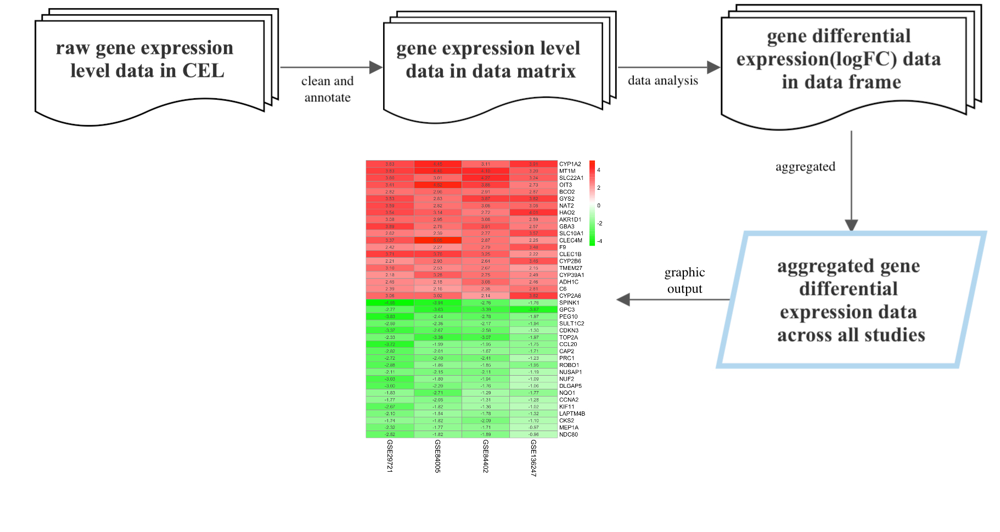

<!-- README.md is generated from README.Rmd. Please edit that file -->

```{r, include = FALSE}
knitr::opts_chunk$set(
  collapse = TRUE,
  comment = "#>",
  fig.path = "man/figures/README-",
  out.width = "100%"
)
```

# DeregGenes

<!-- badges: start -->
<!-- badges: end -->

## Description

The main objective of DeregGenes is to find genes that are deregulated(up-regulate and down- regulate) in different diseases. This package could also allow users to put different results together to generate a heatmap for cross studies analysis. It improves users’ time on massive data cleaning and data annotating processes prior to the analysis since different data prepared by different platforms will need to be handled by different tools. Moreover, this package provides a simple way to let users get a summarised result across multiple current studies data to provide them with a more confident result and conclusion. Also, using this package will save users time to switch back and forth between different distinct packages and learn different documentation since the different packages will require different input data types which is not available on any current published r package.

R requirement: 4.2.0 or later version
Development platform: Mac

## Installation

You can install the development version of DeregGenes from [GitHub](https://github.com/) with:

``` {r}
require("devtools")
devtools::install_github("wezhubb/DeregGenes", build_vignettes = TRUE)
library("DeregGenes")
```

## Overview
``` {r overview}
ls("package:DeregGenes")
browseVignettes("DeregGenes")
```
{ width=75% }

## Contributions

## Acknowledgements
This package was developed as part of an assessment for 2022f BCB410H: Applied Bioinformatics, University of Toronto, Toronto, Canada.

## References
Carvalho B. S., and Irizarry, R. A. 2010. A Framework for Oligonucleotide Microarray Preprocessing Bioinformatics.

Gautier, L., Cope, L., Bolstad, B. M., and Irizarry, R. A. 2004. affy---analysis of Affymetrix GeneChip data at the probe level. Bioinformatics 20, 3 (Feb. 2004), 307-315.

Mapping identifiers for the integration of genomic datasets with the R/Bioconductor package biomaRt. Steffen Durinck, Paul T. Spellman, Ewan Birney and Wolfgang Huber, Nature Protocols 4, 1184-1191 (2009).

BioMart and Bioconductor: a powerful link between biological databases and microarray data analysis. Steffen Durinck, Yves Moreau, Arek Kasprzyk, Sean Davis, Bart De Moor, Alvis Brazma and Wolfgang Huber, Bioinformatics 21, 3439-3440 (2005).

Wickham H, Averick M, Bryan J, Chang W, McGowan LD, François R, Grolemund G, Hayes A, Henry L, Hester J, Kuhn M, Pedersen TL, Miller E, Bache SM, Müller K, Ooms J, Robinson D, Seidel DP, Spinu V, Takahashi K, Vaughan D, Wilke C, Woo K, Yutani H (2019). “Welcome to the tidyverse.” _Journal of Open Source Software_, *4*(43), 1686. doi:10.21105/joss.01686 <https://doi.org/10.21105/joss.01686>.

Wickham H, François R, Henry L, Müller K (2022). _dplyr: A Grammar of Data Manipulation_. R package version 1.0.10, <https://CRAN.R-project.org/package=dplyr>.

Ritchie, M.E., Phipson, B., Wu, D., Hu, Y., Law, C.W., Shi, W., and Smyth, G.K. (2015). limma powers differential expression analyses for RNA-sequencing and microarray studies. Nucleic Acids Research 43(7), e47.

Hastie T, Tibshirani R, Narasimhan B, Chu G (2022). _impute: impute: Imputation for microarray data_. R package version 1.70.0.

Kolde R (2022). _RobustRankAggreg: Methods for Robust Rank Aggregation_. R package version 1.2.1, <https://CRAN.R-project.org/package=RobustRankAggreg>.

Kolde R (2019). _pheatmap: Pretty Heatmaps_. R package version 1.0.12, <https://CRAN.R-project.org/package=pheatmap>.

