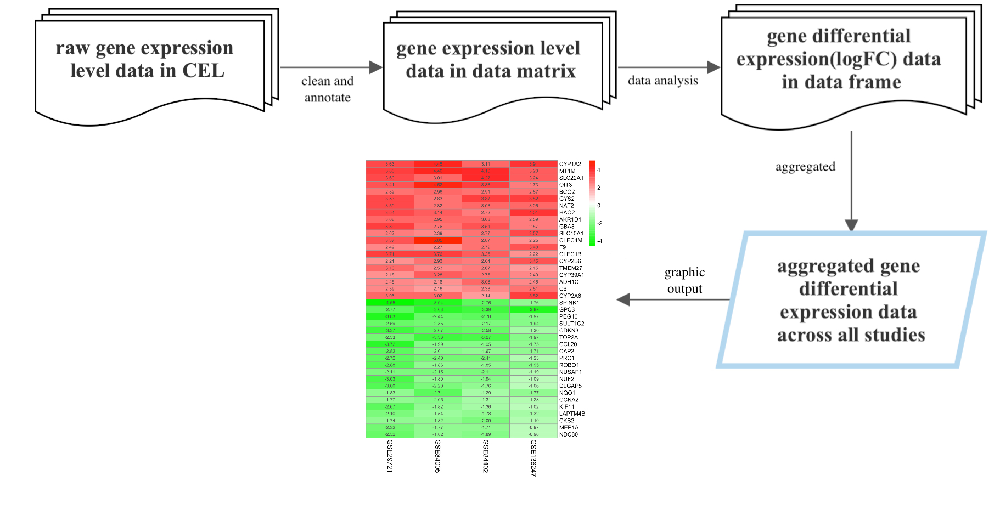

<!-- README.md is generated from README.Rmd. Please edit that file -->

# DeregGenes

<!-- badges: start -->
<!-- badges: end -->

## Description

The main objective of `DeregGenes` is to find genes that are
deregulated(up-regulate and down- regulate) in different diseases. This
package could also allow users to put different results together to
generate a heatmap for cross studies analysis. It improves users’ time
on massive data cleaning and data annotating processes prior to the
analysis since different data prepared by different platforms will need
to be handled by different tools. Moreover, this package provides a
simple way to let users get a summarised result across multiple current
studies data to provide them with a more confident result and
conclusion. Also, using this package will save users time to switch back
and forth between different distinct packages and learn different
documentation since the different packages will require different input
data types which is not available on any current published r package.

-   R requirement: 4.2.0 or later version

-   Development platform: Mac

## Installation

You can install the development version of DeregGenes from
[GitHub](https://github.com/) with:

``` r
require("devtools")
devtools::install_github("wezhubb/DeregGenes", build_vignettes = TRUE)
library("DeregGenes")
```

## Overview

``` r
ls("package:DeregGenes")
browseVignettes("DeregGenes")
```

There are 4 functions in `DeregGenes`

`prepareData`: A function used to clean and annotate the data, including
handling raw CEL format data, putting together different individual
samples into a table, converting different gene IDs and probe IDs to
universal HGNC gene symbols, and joining different tables. This function
will create a data matrix in which each row represent different
gene(with the gene symbol in its rowname), and each column represent
different gene’s expression level in different sample.

`logFCsingle`: A function to analyze the gene expression data to find
gene expression fold change/gene differential expression for each gene
in a single study. This function will create a data frame where each row
represent different genes, and six columns that gives expressional
change(logFC), average expression(AveExpr), t value(t), p
value(P.Value), adjusted p value(adj.P.Val), and log-odd
ratio/B-statistic(B).

`Aggreg`: A function to aggregate different gene expression fold changes
across different studies. This function will create a list of length
three. The first element of the list is a data frame of up-regulated
differential genes. The second element of the list is a data frame of
down-regulated differential genes. For the first two data frame, each
row a a different genes, and there will be four columns: gene
symbol(Name), p value(Pvalue), adjust p value(adjPvalue), and
expressional change(logFC). The last element of the list is a aggregated
data frame where each row is a gene, and each column is the logFC of
different studies.



## Contributions

## Acknowledgements

This package was developed as part of an assessment for 2022f BCB410H:
Applied Bioinformatics, University of Toronto, Toronto, Canada.

## References

Carvalho B. S., and Irizarry, R. A. 2010. A Framework for
Oligonucleotide Microarray Preprocessing Bioinformatics.

Gautier, L., Cope, L., Bolstad, B. M., and Irizarry, R. A. 2004.
affy—analysis of Affymetrix GeneChip data at the probe level.
Bioinformatics 20, 3 (Feb. 2004), 307-315.

Mapping identifiers for the integration of genomic datasets with the
R/Bioconductor package biomaRt. Steffen Durinck, Paul T. Spellman, Ewan
Birney and Wolfgang Huber, Nature Protocols 4, 1184-1191 (2009).

BioMart and Bioconductor: a powerful link between biological databases
and microarray data analysis. Steffen Durinck, Yves Moreau, Arek
Kasprzyk, Sean Davis, Bart De Moor, Alvis Brazma and Wolfgang Huber,
Bioinformatics 21, 3439-3440 (2005).

Wickham H, Averick M, Bryan J, Chang W, McGowan LD, François R,
Grolemund G, Hayes A, Henry L, Hester J, Kuhn M, Pedersen TL, Miller E,
Bache SM, Müller K, Ooms J, Robinson D, Seidel DP, Spinu V, Takahashi K,
Vaughan D, Wilke C, Woo K, Yutani H (2019). “Welcome to the tidyverse.”
*Journal of Open Source Software*, *4*(43), 1686.
<doi:10.21105/joss.01686> <https://doi.org/10.21105/joss.01686>.

Wickham H, François R, Henry L, Müller K (2022). *dplyr: A Grammar of
Data Manipulation*. R package version 1.0.10,
<https://CRAN.R-project.org/package=dplyr>.

Ritchie, M.E., Phipson, B., Wu, D., Hu, Y., Law, C.W., Shi, W., and
Smyth, G.K. (2015). limma powers differential expression analyses for
RNA-sequencing and microarray studies. Nucleic Acids Research 43(7),
e47.

Hastie T, Tibshirani R, Narasimhan B, Chu G (2022). *impute: impute:
Imputation for microarray data*. R package version 1.70.0.

Kolde R (2022). *RobustRankAggreg: Methods for Robust Rank Aggregation*.
R package version 1.2.1,
<https://CRAN.R-project.org/package=RobustRankAggreg>.

Kolde R (2019). *pheatmap: Pretty Heatmaps*. R package version 1.0.12,
<https://CRAN.R-project.org/package=pheatmap>.
