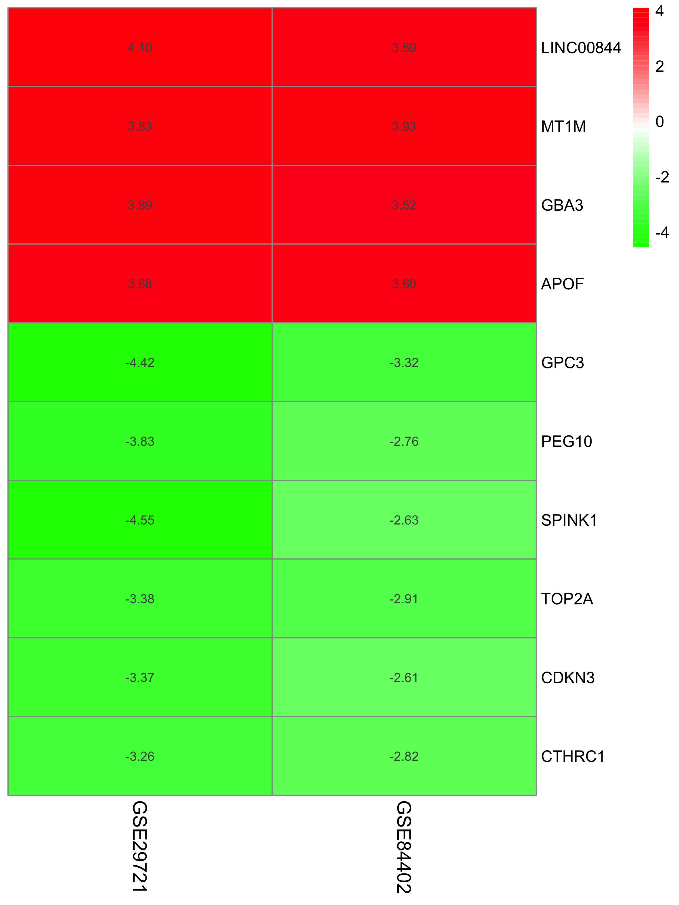

```{r, include = FALSE}
knitr::opts_chunk$set(
  collapse = TRUE,
  message = FALSE,
  warning = FALSE,
  comment = "#>"
)
```

```{r setup}
library(DeregGenes)

# load in helper packages for the demo
library(GEOquery)
```

## Introduction

The main objective of **DeregGenes** is to find genes that are deregulated(up-regulate and down-regulate) in different diseases. This package could also allow users to put different results together to generate a heatmap for cross studies analysis by function __*prepareData*__ . It improves users’ time on massive data cleaning and data annotating processes prior to the analysis since different data prepared by different platforms will need to be handled by different tools. This package also allows user to compute gene differential expression data for single study using function __*logFCsingle*__. Moreover, the function __*Aggreg*__ provides a simple way to let users get a summarised result across multiple current studies data to provide them with a more confident result and conclusion. Also, using this package will save users time to switch back and forth between different distinct packages and learn different documentation since the different packages will require different input data types which is not available on any current published r package. Lastly, the package can generate heat maps of gene differential expression across stuides using function __*plotHeatMap*__.

See `help(package = "DeregGenes")` for further details and references provided by `citation("DeregGenes")`. To download **DeregGenes**, use the following commands:

``` r
require("devtools")
install_github("wezhubb/DeregGenes", build_vignettes = TRUE)
library("DeregGenes")
```

To list all functions available in the package:
``` r
lsf.str("package:DeregGenes")
```

To list all sample datasets available in the package:
``` r
data(package = "DeregGenes")
```

## Workflow
In the following session, I will demonstated the use of **DeregGenes** by analysis of gene expression data from two GEO data: GSE84402 and GSE29721. 

### Step 1: Preparing and annotating data 
Before the formal analysis, it is important to clean the data by removing NULL value, and annotate data by convert the porbe ID/gene ID to universal HGNC gene symbols. The reason for preparing and annotating data is to make any further analysis easier to perform.

To download the data in current directory:

``` r
# download data1(GSE29721) from GEO into current directory
filePaths <- getGEOSuppFiles("GSE29721")

```

Because the downloaded file is ziped, we need to unzip the file and delete the orignal zip file:

``` r
# untar downloaded data and delete tar file
untarPath <- strsplit(row.names(filePaths), '/')
untarPath <- paste(untarPath[[1]][1:length(untarPath[[1]]) - 1],
     collapse="/")
untar(row.names(filePaths), exdir = untarPath)
unlink(paste(untarPath, '/*.tar', sep = ''))

```

We will then preparing data with __*prepareData*__ function:

__*prepareData*__ is a function used to clean and annotate the data, including handling raw CEL format data, putting together different individual samples into a table, converting different gene IDs and probe IDs to universal HGNC gene symbols, and joining different tables. This function will create a data matrix in which each row represent different gene(with the gene symbol in its rowname), and each column represent different gene's expression level in different sample. 

This function takes two inputs. 

The first input takes a string of the file path to local directory in which that directory only contain CEL gene expression level format data. Notice in order to fulfill the purpose of this analysis, all the sample data from the celpath directory will be from the same study.

The second input take a boolean/logical vector represent the platform of the sample being prepared. This function will work on two platfrom: Affymetrix and Entrez. If the data is prepared by Affymetrix, then enter TRUE, otherwise, enter FALSE.

``` r
# preparing data
data <- prepareData(untarPath, TRUE)
head(data)
```

```{r echo=FALSE}
head(GSE29721)
```

After finishing the preparing process and stored the data, we can delete the download files:

``` r
# delete all download data from current directory
unlink(untarPath, recursive = TRUE)
```

### Step 2: Compute differential expression data for each study
With the data being cleaned and annotated, we can now compute the gene differnetial expression/expressional fold change using __*logFCsingle*__ function.

__*logFCsingle*__ is a function to analyze the gene expression data to find gene expression fold change/gene differential expression for each gene in a single study. This function will create a data frame where each row represent different genes, and six columns that gives expressional change(logFC), average expression(AveExpr), t value(t), p value(P.Value), adjusted p value(adj.P.Val), and log-odd ratio/B-statistic(B).

This function takes two inputs. 

The first input takes a data matrix of gene expression level data, where each row represent different gene and each column represent different gene's expression level in different sample

The second input take a vector in which the length equals to the number of column in expressionLevel. This vector will be consist of only two strings "mutant" and "control", the "mutant" represent disease sample and "control" represent healthy individual sample. The two strings are organized in the same order of the columns in expressionLevel. For example, if the first five samples in expressionLevel are disease, disease, healthy, disease, healthy. Then the setUp inputed will be c("mutant", "mutant", "control", "mutant", "control")

Compute differential expression for GSE29721

```{r logFC_data1, results='hide'}
# class is the order of the each sample type in GSE29721
class <- c("mutant", "control","mutant", "control","mutant", "control",
     "mutant", "control","mutant", "control","mutant", "control", "mutant",
     "control","mutant", "control","mutant", "control", "mutant", "control")

# here we will use data GSE29721 in the package, which is the same as data in the previous section
result1 <- logFCsingle(GSE29721, class)
```

View result1
```{r}
head(result1)

```

Compute differential expression for GSE84402

```{r logFC_data2, results='hide'}
# class is the order of the each sample type in GSE84402
class <- c("mutant", "control","mutant", "control","mutant", "control",
     "mutant", "control","mutant", "control","mutant", "control", "mutant",
     "control","mutant", "control","mutant", "control", "mutant", "control",
     "mutant", "control","mutant", "control", "mutant", "control","mutant",
     "control")
result2 <- logFCsingle(GSE84402, class)
```

View result2
```{r}
head(result2)
```

### Step 3: Aggregate differential expression from GSE29721 and GSE84402

With the single study differential expression data with fold change, we need to aggregate them together to find each genes overall performance across all studies using __*Aggreg*__ function.

__*Aggreg*__ is a function to aggregate different gene expression fold changes across different studies. This function will create a list of length three. The first element of the list is a data frame of up-regulated differential genes. The second element of the list is a data frame of down-regulated differential genes. For the first two data frame, each row a a different genes, and there will be four columns: gene symbol(Name), p value(Pvalue), adjust p value(adjPvalue), and expressional change(logFC). The last element of the list is a aggregated data frame where each row is a gene, and each column is the logFC of different studies.

This function takes four inputs. 

The first input takes a vector of all the studies gene differential expression data. For each study's data, the format should be in data frame, and each row represent different genes(with the gene symbol as its row name). The first should be the expressional change(logFC)

The second input take a vector of strings. The length of listTile should be the same of the length of the listLogFC. listTile should consist of the title/name of the studies as in the same orders of the studies in listLogFC

The third input take a numeric vector that represent the adjust p value threshold, if nothing is entered, the default value of 0.01 will be used.

The fourth input take a numeric vector that represent the logFC threshold, if  nothing is entered, the default value of 1 will be used.

```{r aggregate}
# create list of input  data
listLogFC <- list(result1, result2)

# create list of data title
listTitle <- c("GSE29721", "GSE84402")

# aggregate
aggreg <- Aggreg(listLogFC, listTitle)

head(aggreg[1])

head(aggreg[2])

head(aggreg[3])

```

### Step 4: Drawing heat map
With the aggregate data, we can draw the heatmap now using __*plotHeatMap*__ function.

__*plotHeatMap*__ is a function to draw a heatmap representation of differential gene expression corss different studies. Notice that this function will not return the heatmap, but will stored the heat map in local directory.

This function takes three inputs. 

The first input takes a dataframe where each row is a gene(row name is the gene symbol),and each column is the logFC of different studies(column name is the study name). The data frame must be in order, where the gene with highest logFC value acorss all studies should be at the top, and the gene with lowest logFC value acorss all studies should be at the bottom

The second input take a numeric vector indicate the top n numbers of genes with significant logFC values from up-regulated data. This number must bigger than 1. Notice that n must be smaller or equal the number of genes that are up-regulated in data.

The third input take a numeric vector indicate the top n numbers of genes with significant logFC values from down-regulated data. This number must bigger than 1. Notice that n must be smaller or equal the number of genes that are down-regulated in data.

```
plotHeatMap(data.frame(aggreg[3]), 4, 6)

```
```{r, out.width = "400px", echo = FALSE}

```


## References
* Carvalho B. S., and Irizarry, R. A. 2010. A Framework for Oligonucleotide Microarray Preprocessing Bioinformatics.

* Gautier, L., Cope, L., Bolstad, B. M., and Irizarry, R. A. 2004. affy---analysis of Affymetrix GeneChip data at the probe level. Bioinformatics 20, 3 (Feb. 2004), 307-315.

* Mapping identifiers for the integration of genomic datasets with the R/Bioconductor package biomaRt. Steffen Durinck, Paul T. Spellman, Ewan Birney and Wolfgang Huber, Nature Protocols 4, 1184-1191 (2009).

* BioMart and Bioconductor: a powerful link between biological databases and microarray data analysis. Steffen Durinck, Yves Moreau, Arek Kasprzyk, Sean Davis, Bart De Moor, Alvis Brazma and Wolfgang Huber, Bioinformatics 21, 3439-3440 (2005).

* Wickham H, Averick M, Bryan J, Chang W, McGowan LD, François R, Grolemund G, Hayes A, Henry L, Hester J, Kuhn M, Pedersen TL, Miller E, Bache SM, Müller K, Ooms J, Robinson D, Seidel DP, Spinu V, Takahashi K, Vaughan D, Wilke C, Woo K, Yutani H (2019). “Welcome to the tidyverse.” _Journal of Open Source Software_, *4*(43), 1686. doi:10.21105/joss.01686 <https://doi.org/10.21105/joss.01686>.

* Wickham H, François R, Henry L, Müller K (2022). _dplyr: A Grammar of Data Manipulation_. R package version 1.0.10, <https://CRAN.R-project.org/package=dplyr>.

* Ritchie, M.E., Phipson, B., Wu, D., Hu, Y., Law, C.W., Shi, W., and Smyth, G.K. (2015). limma powers differential expression analyses for RNA-sequencing and microarray studies. Nucleic Acids Research 43(7), e47.

* Hastie T, Tibshirani R, Narasimhan B, Chu G (2022). _impute: impute: Imputation for microarray data_. R package version 1.70.0.

* Kolde R (2022). _RobustRankAggreg: Methods for Robust Rank Aggregation_. R package version 1.2.1, <https://CRAN.R-project.org/package=RobustRankAggreg>.

* Kolde R (2019). _pheatmap: Pretty Heatmaps_. R package version 1.0.12, <https://CRAN.R-project.org/package=pheatmap>.

* Wang H, Huo X, Yang XR, He J et al. STAT3-mediated upregulation of lncRNA HOXD-AS1 as a ceRNA facilitates liver cancer metastasis by regulating SOX4. Mol Cancer 2017 Aug 14;16(1):136. PMID: 28810927

* Stefanska B, Huang J, Bhattacharyya B, Suderman M et al. Definition of the landscape of promoter DNA hypomethylation in liver cancer. Cancer Res 2011 Sep 1;71(17):5891-903. PMID: 21747116

* Wang H, Huo X, Yang XR, He J et al. STAT3-mediated upregulation of lncRNA HOXD-AS1 as a ceRNA facilitates liver cancer metastasis by regulating SOX4. Mol Cancer 2017 Aug 14;16(1):136. PMID: 28810927

* Stefanska B, Huang J, Bhattacharyya B, Suderman M et al. Definition of the landscape of promoter DNA hypomethylation in liver cancer. Cancer Res 2011 Sep 1;71(17):5891-903. PMID: 21747116


```{r}
sessionInfo()
```
